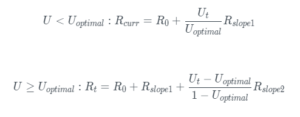

# Модель процентной ставки

Процентные ставки делятся на две категории: ставки заемщика и ставки заимодавца. Ставки заимодавца — это годовые ставки, выплачиваемые заимодавцам, в то время как процентные ставки заемщиков – годовые процентные ставки, выплачиваемые заемщиками.

* Когда U < U(оптимальной), процентные ставки по займам медленно увеличиваются по мере использования
* Когда U ≥ U(оптимальной) процентные ставки по займам резко увеличиваются, чтобы стимулировать увеличение депозита и избежать риска ликвидности.
